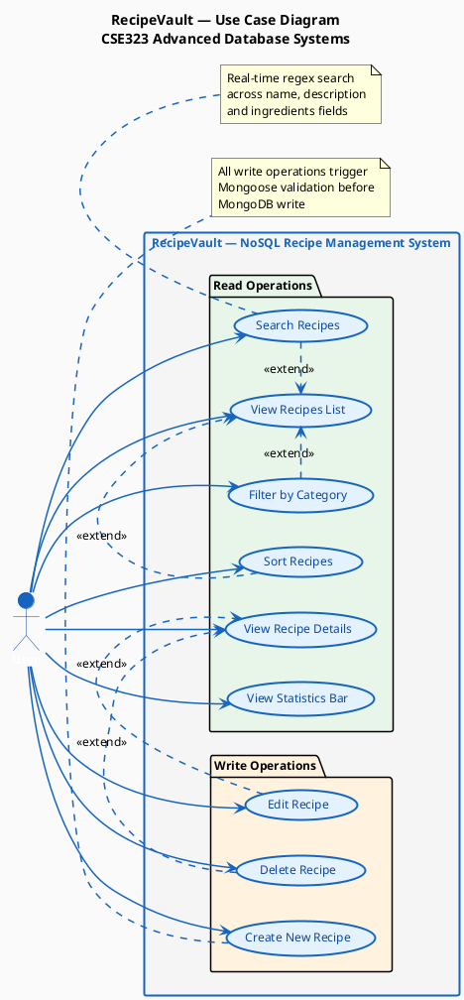
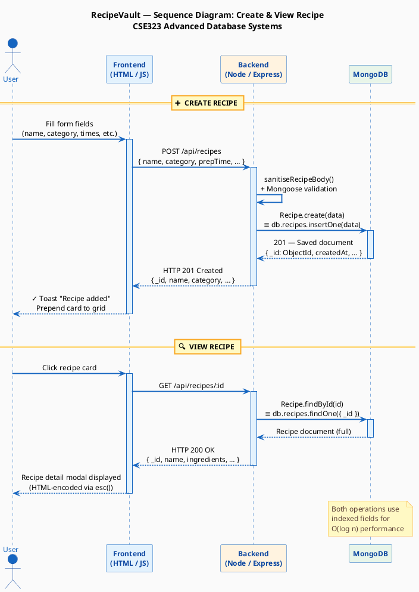
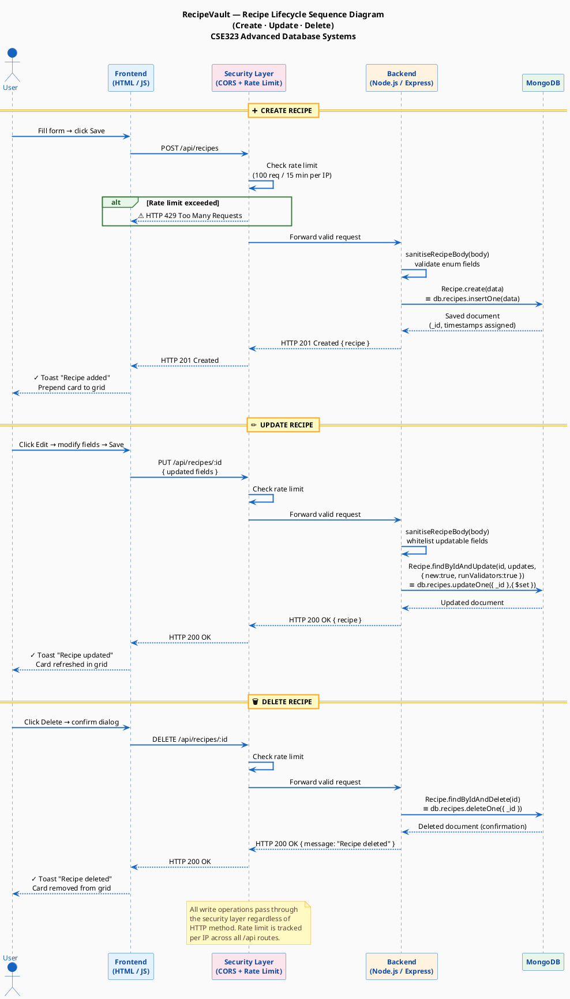
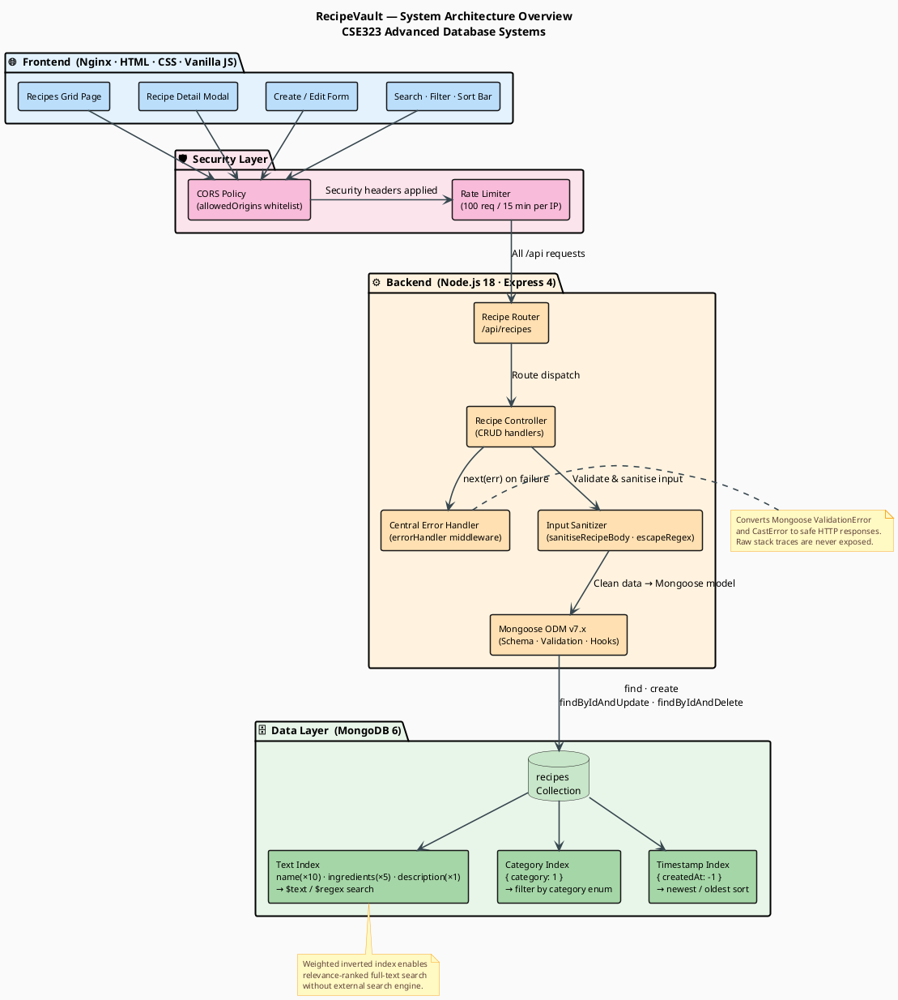
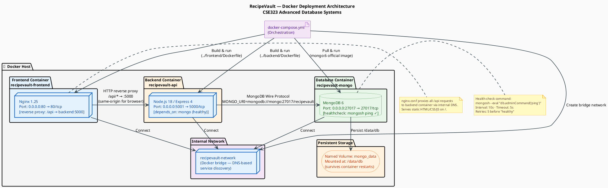
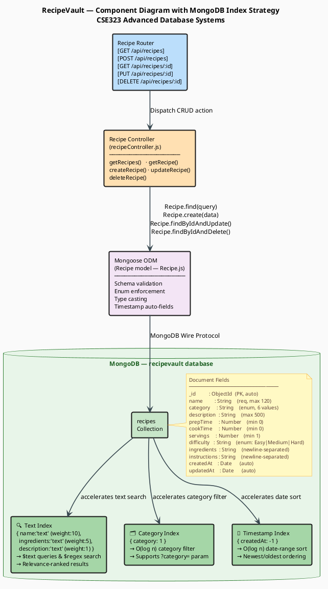
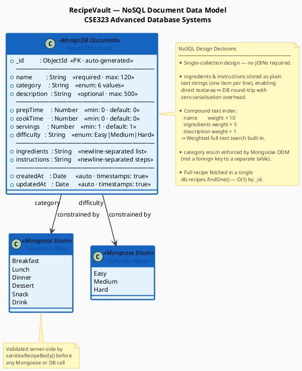
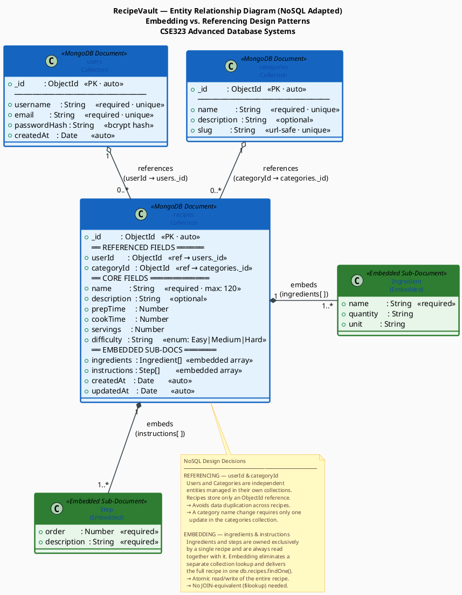

# RecipeVault — CSE323 Advanced Database Systems
## Comprehensive Project Documentation & Deliverables

> **Course:** CSE323 — Advanced Database Systems  
> **Application:** RecipeVault — NoSQL Recipe Book  
> **Tech Stack:** HTML · CSS · Vanilla JavaScript · Node.js · Express · MongoDB (Mongoose) · Docker  
> **Repository:** [github.com/ArwaMohey/ADB-Project](https://github.com/ArwaMohey/ADB-Project)

---

## Table of Contents

1. [Project Proposal](#1-project-proposal)
   - [1.1 Application Idea](#11-application-idea)
   - [1.2 Target Audience](#12-target-audience)
   - [1.3 Rationale for Choosing MongoDB](#13-rationale-for-choosing-mongodb-over-a-relational-database)
2. [System Design & UML Diagrams](#2-system-design--uml-diagrams)
   - [2.1 Use Case Diagram](#21-use-case-diagram)
   - [2.2 Sequence Diagram — Create & View Recipe](#22-sequence-diagram--create--view-recipe)
   - [2.3 Sequence Diagram — Recipe Lifecycle (Create / Update / Delete)](#23-sequence-diagram--recipe-lifecycle-create--update--delete)
   - [2.4 Architecture Overview](#24-architecture-overview)
   - [2.5 Deployment Architecture](#25-deployment-architecture)
   - [2.6 Component Diagram with MongoDB Indexes](#26-component-diagram-with-mongodb-indexes)
   - [2.7 Data Model — NoSQL Document Schema](#27-data-model--nosql-document-schema)
   - [2.8 Entity Relationship Diagram (ERD — NoSQL Adapted)](#28-entity-relationship-diagram-erd--nosql-adapted)
3. [Documentation](#3-documentation)
   - [3.1 Project Objectives](#31-project-objectives)
   - [3.2 Design Decisions & Implementation Details](#32-design-decisions--implementation-details)
   - [3.3 Running & Testing with Docker](#33-running--testing-with-docker)
   - [3.4 Sorting Algorithm — Efficiency & Time Complexity](#34-sorting-algorithm--efficiency--time-complexity)
   - [3.5 API Reference](#35-api-reference)
   - [3.6 File & Directory Structure](#36-file--directory-structure)
4. [Presentation Outline](#4-presentation-outline)

---

## 1. Project Proposal

### 1.1 Application Idea

**RecipeVault** is a full-stack web application that enables users to manage a personal collection of culinary recipes. Through a clean, browser-based interface, users can **create**, **read**, **update**, and **delete** recipes, each described by a rich, heterogeneous set of attributes: a name, category, free-text description, preparation and cook times, serving count, difficulty rating, a multi-line ingredients list, and step-by-step instructions. Additional features include real-time **text search** across name, description, and ingredients; **category filtering** (Breakfast, Lunch, Dinner, Dessert, Snack, Drink); and **multi-criterion sorting** (by date, alphabetically, or by total cook time).

### 1.2 Target Audience

| Audience Segment | Description |
|---|---|
| **Home Cooks** | Individuals who want to digitise their handwritten recipe books and retrieve recipes instantly |
| **Food Enthusiasts & Bloggers** | Users who curate and share large collections of recipes across varied cuisines |
| **Culinary Students** | Students learning to organise and annotate recipes by technique and difficulty |
| **Small Food Businesses** | Cafés or catering operations that need a lightweight, offline-capable recipe catalogue |

### 1.3 Rationale for Choosing MongoDB over a Relational Database

The choice of MongoDB as the persistence layer is motivated by several technical properties that are uniquely well-matched to a recipe domain:

#### 1.3.1 Schema Flexibility & Varying Attributes

Recipes are inherently heterogeneous. A smoothie recipe requires no cook time; a baked soufflé requires precise oven temperature; a cocktail recipe lists measures in fluid ounces. In a traditional relational model (RDBMS), every recipe row must conform to a fixed, pre-declared schema, forcing the developer to either add sparse `NULL`-filled columns for every possible attribute, or decompose the entity into multiple tables with complex `JOIN` operations. MongoDB's document model stores each recipe as a self-contained JSON document, allowing different recipes to carry only the fields that are relevant to them—without schema migrations.

#### 1.3.2 Natural Fit for Nested & List Data

Ingredients and instructions are ordered lists. In a relational database this would require at least two additional normalised tables (`recipe_ingredients`, `recipe_steps`) with foreign keys and sequential joins. MongoDB stores these as arrays or newline-delimited strings directly within the recipe document, enabling atomic reads and writes of an entire recipe in a single database operation—eliminating round-trip overhead and join complexity.

#### 1.3.3 Rich, Built-in Querying & Indexing

MongoDB's native **text index** (weighted across `name`, `ingredients`, and `description`) allows full-text relevance search without an external search engine. Its **compound index** support means category filtering and `createdAt` sorting execute against in-memory B-tree indexes rather than full collection scans, maintaining sub-millisecond query times even at scale.

#### 1.3.4 Horizontal Scalability

Unlike most SQL databases that scale vertically (larger hardware), MongoDB is architected for horizontal scaling through replica sets and sharding. As the recipe collection grows—potentially to millions of documents for a multi-user platform—MongoDB can distribute data across commodity nodes without application-layer changes.

#### 1.3.5 Developer Productivity with Mongoose ODM

The Mongoose Object Document Mapper provides schema-level validation, enum enforcement, type casting, and lifecycle hooks directly in JavaScript. This eliminates the boilerplate of DTO mapping layers and keeps the data contract close to the application code. Combined with Express.js, this yields an idiomatic JavaScript stack from browser to database with minimal context switching.

#### 1.3.6 Summary Comparison

| Criterion | MongoDB (Document) | PostgreSQL / MySQL (Relational) |
|---|---|---|
| Recipe schema flexibility | ✅ Schema-less per document | ❌ Fixed table schema, migrations required |
| Storing ingredient lists | ✅ Array field in one document | ❌ Separate `recipe_ingredients` table + JOIN |
| Full-text search | ✅ Native weighted text index | ⚠️ Requires extension (e.g., `pg_trgm`) |
| Horizontal scaling | ✅ Sharding built-in | ⚠️ Requires middleware or managed service |
| JSON API integration | ✅ Documents map 1:1 to JSON | ❌ Rows must be serialised / deserialised |
| Prototype velocity | ✅ No migrations for new fields | ❌ `ALTER TABLE` for every new attribute |

---

## 2. System Design & UML Diagrams

> **Instructions for rendering:** Paste any PlantUML block into [https://www.plantuml.com/plantuml](https://www.plantuml.com/plantuml) or use the VS Code PlantUML extension to generate the diagram image.

---

### 2.1 Use Case Diagram

**Description:** Shows all interactions between the single **User** actor and the RecipeVault system. The primary use cases (view, search, filter, sort) are available without prerequisites. The mutating use cases (Create, Edit, Delete) extend from view operations, mirroring the navigation flow in the UI.



---

### 2.2 Sequence Diagram — Create & View Recipe

**Description:** Traces the exact message flow between the four system participants for the two most fundamental operations: creating a new recipe and viewing an existing one. MongoDB operation names (`insertOne`, `findById`) are shown explicitly to emphasise the NoSQL mechanics.



---

### 2.3 Sequence Diagram — Recipe Lifecycle (Create / Update / Delete)

**Description:** Expands the CRUD lifecycle into three consecutive sub-flows, each showing the complete round-trip through the security layer, business logic, and MongoDB. This mirrors the structural style of an authentication sequence diagram (three phased flows) adapted to the stateless CRUD model of RecipeVault.



---

### 2.4 Architecture Overview

**Description:** Component-level view of the entire system, from the browser-rendered frontend pages through the layered Express backend to the indexed MongoDB collections. Modelled after the reference architecture diagram, adapted to the actual stack (Nginx + Vanilla JS instead of Next.js; Express instead of NestJS).



---

### 2.5 Deployment Architecture

**Description:** Shows how `docker-compose.yml` orchestrates three containers on a shared virtual network, including port mappings, health-check dependency, and the named volume that persists MongoDB data across restarts.



---

### 2.6 Component Diagram with MongoDB Indexes

**Description:** Zooms into the data layer to show exactly which indexes Mongoose registers on the `recipes` collection, how each index supports a specific query pattern, and how the controller routes requests through the ODM to take advantage of those indexes.



---

### 2.7 Data Model — NoSQL Document Schema

The following shows the MongoDB document structure for a single recipe, expressed both as a representative JSON document and as the Mongoose schema definition.

#### 2.7.1 Representative MongoDB Document

```json
{
  "_id": "ObjectId('6651a4c2f3b2c8001e4d9e01')",
  "name": "Shakshuka",
  "category": "Breakfast",
  "description": "Poached eggs in spiced tomato and pepper sauce, a classic Middle Eastern dish.",
  "prepTime": 10,
  "cookTime": 25,
  "servings": 4,
  "difficulty": "Easy",
  "ingredients": "2 tbsp olive oil\n1 onion, diced\n3 garlic cloves\n2 cans crushed tomatoes\n1 tsp cumin\n1 tsp paprika\n4 eggs\nFresh parsley",
  "instructions": "Heat oil in a skillet\nSauté onion and garlic until soft\nAdd tomatoes and spices, simmer 15 mins\nMake wells and crack eggs in\nCover and cook 8 mins\nGarnish with parsley",
  "createdAt": "ISODate('2024-05-25T10:30:00.000Z')",
  "updatedAt": "ISODate('2024-05-25T10:30:00.000Z')"
}
```

#### 2.7.2 Mongoose Schema Definition (models/Recipe.js — annotated)

```javascript
const RecipeSchema = new mongoose.Schema(
  {
    // ── Core Identification ──────────────────────────────────────────
    name: {
      type: String,
      required: true,          // enforced at ODM level before DB write
      trim: true,
      maxlength: 120,
    },
    category: {
      type: String,
      required: true,
      enum: ['Breakfast','Lunch','Dinner','Dessert','Snack','Drink'],
                               // MongoDB stores as plain String; enum is ODM guard
    },
    description: {
      type: String,
      trim: true,
      default: '',
      maxlength: 500,
    },

    // ── Time & Serving Metadata ──────────────────────────────────────
    prepTime:   { type: Number, min: 0, default: 0 },
    cookTime:   { type: Number, min: 0, default: 0 },
    servings:   { type: Number, min: 1, default: 1 },
    difficulty: { type: String, enum: ['Easy','Medium','Hard'], default: 'Easy' },

    // ── Rich Content (newline-delimited strings) ─────────────────────
    ingredients:  { type: String, default: '', trim: true },
    instructions: { type: String, default: '', trim: true },
  },
  {
    timestamps: true,          // adds createdAt, updatedAt automatically
    toJSON: { versionKey: false },
  }
);

// Compound text index with field weights (higher weight = higher relevance score)
RecipeSchema.index(
  { name: 'text', description: 'text', ingredients: 'text' },
  { weights: { name: 10, ingredients: 5, description: 1 } }
);
```

#### 2.7.3 Entity Relationship — NoSQL Data Model (PlantUML)



---

### 2.8 Entity Relationship Diagram (ERD — NoSQL Adapted)

**Description:** Illustrates how three logically related MongoDB collections — `users`, `categories`, and `recipes` — are modelled using the two canonical NoSQL patterns: **document embedding** (for tightly owned sub-data) and **document referencing** (for independently managed entities). This diagram demonstrates deliberate NoSQL design decisions rather than a direct translation of a relational schema.



---

## 3. Documentation

### 3.1 Project Objectives

| # | Objective | Outcome |
|---|---|---|
| **O1** | Demonstrate proficiency in NoSQL database design using MongoDB | Single-collection document model with compound text index, enum validation, and timestamping |
| **O2** | Implement a full CRUD REST API following MVC architecture | Five endpoints (`GET /`, `GET /:id`, `POST /`, `PUT /:id`, `DELETE /:id`) across Router → Controller → Model layers |
| **O3** | Build a responsive, interactive frontend without a framework | Vanilla JS SPA with dynamic DOM rendering, modal system, toast notifications, and client-side filtering |
| **O4** | Apply security best practices to the API layer | CORS origin whitelisting, rate limiting (100 req/15 min), input sanitisation (`escapeRegex`), enum whitelisting |
| **O5** | Containerise the full application using Docker | Three-container `docker-compose.yml` with health-check dependency, named volume, and internal network |
| **O6** | Implement and analyse a sorting algorithm | Four sort modes (newest, oldest, A→Z, by total cook time) using JavaScript's native `Array.prototype.sort` (TimSort, O(n log n)) |

---

### 3.2 Design Decisions & Implementation Details

#### 3.2.1 MVC Architecture

The backend follows a strict **Model–View–Controller** separation:

| Layer | File | Responsibility |
|---|---|---|
| **Model** | `backend/models/Recipe.js` | Mongoose schema definition, field validation, enum constraints, text index registration |
| **Controller** | `backend/controllers/recipeController.js` | Business logic — query construction, input sanitisation, Mongoose method calls, HTTP response codes |
| **Router (View bridge)** | `backend/routes/recipes.js` | HTTP verb → controller function mapping; no business logic |
| **Entry point** | `backend/server.js` | Express app bootstrap, middleware registration (CORS, rate limit, body parser, error handler) |

The **View** layer is entirely decoupled: the Express API is stateless and returns JSON; the HTML/JS frontend is a separate container and consumes the API over HTTP.

#### 3.2.2 CRUD Operations — End-to-End Flow

| Operation | HTTP Method & Route | Mongoose Call | MongoDB Equivalent |
|---|---|---|---|
| List all | `GET /api/recipes` | `Recipe.find(query).sort({ createdAt: -1 })` | `db.recipes.find(query).sort({ createdAt: -1 })` |
| Get one | `GET /api/recipes/:id` | `Recipe.findById(id)` | `db.recipes.findOne({ _id: ObjectId(id) })` |
| Create | `POST /api/recipes` | `Recipe.create(data)` | `db.recipes.insertOne(data)` |
| Update | `PUT /api/recipes/:id` | `Recipe.findByIdAndUpdate(id, updates, { new:true, runValidators:true })` | `db.recipes.updateOne({ _id }, { $set: updates })` |
| Delete | `DELETE /api/recipes/:id` | `Recipe.findByIdAndDelete(id)` | `db.recipes.deleteOne({ _id: ObjectId(id) })` |

#### 3.2.3 Search & Filtering Implementation

Search uses a MongoDB regex query built server-side after sanitising the input with `escapeRegex()` to prevent regex injection:

```javascript
// From recipeController.js — getRecipes handler
const safeSearch = escapeRegex(String(search).slice(0, 200));
query.$or = [
  { name:        { $regex: safeSearch, $options: 'i' } },
  { description: { $regex: safeSearch, $options: 'i' } },
  { ingredients: { $regex: safeSearch, $options: 'i' } },
];
```

The compound text index (registered on the Mongoose schema) further accelerates these queries by pre-building an inverted index across all three fields with weighted relevance scoring.

#### 3.2.4 Frontend State Management

The frontend maintains a client-side cache (`let recipes = []`) that mirrors the MongoDB collection. On initial load, `GET /api/recipes` populates this array. Subsequent CRUD operations update both the server (via API call) and the local array, enabling instant DOM updates without a full data reload. Client-side `filterRecipes()` then applies filtering, search, and sorting against the cached array before calling `renderGrid()`.

#### 3.2.5 Security Measures

| Concern | Implementation |
|---|---|
| **CORS** | `allowedOrigins` array in `server.js`; only whitelisted origins receive a valid CORS response header |
| **Rate Limiting** | `express-rate-limit`: 100 requests per 15-minute window per IP; returns `429` with a descriptive error JSON |
| **Input Sanitisation** | `sanitiseRecipeBody()` whitelists and type-casts every accepted field; `escapeRegex()` neutralises regex metacharacters in search terms |
| **Enum Validation** | Categories and difficulties validated against hard-coded arrays before touching the database |
| **Error Normalisation** | Central `errorHandler` middleware converts Mongoose `ValidationError` and `CastError` to user-friendly JSON with appropriate HTTP status codes; raw stack traces are never exposed |
| **XSS Prevention** | Frontend `esc()` function HTML-encodes all user-supplied content before inserting it into the DOM |

#### 3.2.6 Docker Containerisation

The application is split into three Docker services defined in `docker/docker-compose.yml`:

| Service | Image | Host Port | Role |
|---|---|---|---|
| `frontend` | Built from `docker/Dockerfile` (Nginx) | `80` | Serves static HTML/CSS/JS; reverse-proxies `/api` to the backend container |
| `backend` | Built from `backend/Dockerfile` (Node.js 18) | `5001→5000` | Express REST API |
| `mongo` | `mongo:6` (official) | `27017` | MongoDB database; health-checked via `mongosh ping` |

A named volume `mongo_data` persists recipe data across container restarts. All three containers share the default Compose network, allowing DNS-based service discovery (`mongodb://mongo:27017/recipevault`).

---

### 3.3 Running & Testing with Docker

#### 3.3.1 Prerequisites

- **Docker Desktop** (Windows / macOS) or **Docker Engine + Docker Compose** (Linux), version 20.10+
- **Git** (to clone the repository)
- No local Node.js or MongoDB installation required — everything runs inside containers.

#### 3.3.2 Step-by-Step Setup

```bash
# 1. Clone the repository
git clone https://github.com/ArwaMohey/ADB-Project.git
cd "ADB-Project/Recipes App/Recipes App-main"

# 2. Create the environment file
#    (or copy and edit the example if provided)
cat > .env <<EOF
MONGO_URI=mongodb://localhost:27017/recipevault
CORS_ORIGIN=http://localhost
BACKEND_PORT=5001
EOF

# 3. Build all images and start containers (detached)
docker compose -f docker/docker-compose.yml up --build -d

# 4. Verify all containers are healthy
docker compose -f docker/docker-compose.yml ps
# Expected output:
# NAME                    STATUS          PORTS
# recipevault-frontend    Up (healthy)    0.0.0.0:80->80/tcp
# recipevault-api         Up              0.0.0.0:5001->5000/tcp
# recipevault-mongo       Up (healthy)    0.0.0.0:27017->27017/tcp

# 5. (Optional) Seed the database with sample Egyptian recipes
docker exec recipevault-api node seed.js

# 6. Open the application
#    → http://localhost
```

#### 3.3.3 Functional Testing Walkthrough

| Test | Steps | Expected Result |
|---|---|---|
| **App loads** | Open `http://localhost` | Recipe grid renders; stats bar shows totals |
| **Create recipe** | Click "+ Add Recipe" → fill form → Save | Toast "Recipe added"; new card appears at top of grid |
| **View details** | Click any recipe card | Detail modal opens with all fields |
| **Edit recipe** | Click "Edit" on any card → modify name → Save | Toast "Recipe updated"; card reflects new name |
| **Delete recipe** | Click "Delete" → Confirm | Toast "Recipe deleted"; card removed from grid |
| **Search** | Type "egg" in search box | Grid filters to recipes containing "egg" in name, description, or ingredients |
| **Category filter** | Select "Breakfast" from dropdown | Only Breakfast recipes shown |
| **Sort by cook time** | Select "By cook time" | Cards re-ordered by ascending `prepTime + cookTime` |
| **Rate limit** | Send > 100 requests in 15 min | API returns `429 Too Many Requests` |
| **Invalid ID** | `GET /api/recipes/badid` | API returns `400 Invalid recipe ID format` |
| **Health check** | `GET http://localhost:5001/health` | Returns `{ "status": "ok", "timestamp": "…" }` |

#### 3.3.4 Stopping & Cleanup

```bash
# Stop and remove containers (data preserved in volume)
docker compose -f docker/docker-compose.yml down

# Stop and REMOVE all data (volume deleted)
docker compose -f docker/docker-compose.yml down -v

# View backend logs
docker logs recipevault-api --follow

# Open MongoDB shell inside the container
docker exec -it recipevault-mongo mongosh recipevault
  > db.recipes.find().pretty()
  > db.recipes.countDocuments()
  > db.recipes.getIndexes()
```

---

### 3.4 Sorting Algorithm — Efficiency & Time Complexity

#### 3.4.1 Algorithm Used

RecipeVault implements **four client-side sort modes** inside `renderGrid()` in `frontend/app.js`, all delegating to JavaScript's native `Array.prototype.sort()`:

```javascript
if      (currentSort === 'newest') docs.sort((a, b) => new Date(b.createdAt) - new Date(a.createdAt));
else if (currentSort === 'oldest') docs.sort((a, b) => new Date(a.createdAt) - new Date(b.createdAt));
else if (currentSort === 'az')     docs.sort((a, b) => a.name.localeCompare(b.name));
else if (currentSort === 'time')   docs.sort((a, b) => (a.cookTime + a.prepTime) - (b.cookTime + b.prepTime));
```

#### 3.4.2 Underlying Algorithm — TimSort

All modern JavaScript engines (V8, SpiderMonkey) implement `Array.prototype.sort` using **TimSort**, a hybrid algorithm combining **Merge Sort** and **Insertion Sort**.

| Property | Detail |
|---|---|
| **Strategy** | Divides array into natural "runs"; sorts runs with Insertion Sort; merges runs with Merge Sort |
| **Stable** | ✅ Yes — equal elements preserve their original relative order |
| **Adaptive** | ✅ Yes — performs better on partially-sorted data (common when recipes are already date-ordered from the API) |

#### 3.4.3 Time & Space Complexity

| Scenario | Time Complexity | Explanation |
|---|---|---|
| **Best case** | **O(n)** | Array already sorted; TimSort detects natural runs and performs no merges |
| **Average case** | **O(n log n)** | Random order; standard Merge Sort merge-phase dominates |
| **Worst case** | **O(n log n)** | Reverse-sorted input; guaranteed upper bound, no O(n²) degradation |
| **Space complexity** | **O(n)** | Auxiliary space for merge buffers |

> Where **n** = the number of recipe cards currently in the filtered result set.

#### 3.4.4 Comparator Complexity

| Sort Mode | Comparator Operation | Per-comparison Cost |
|---|---|---|
| Newest / Oldest | `new Date(str) - new Date(str)` | O(1) numeric subtraction after date parse |
| A → Z | `String.localeCompare()` | O(k) where k = average string length (name ≤ 120 chars) — effectively O(1) |
| By cook time | `(a.cookTime + a.prepTime) - (b.cookTime + b.prepTime)` | O(1) integer arithmetic |

#### 3.4.5 Why Client-Side Sorting?

The decision to sort on the client rather than delegating to MongoDB's `.sort()` is intentional:

1. **Data is already fetched** — all recipes are loaded once into the `recipes[]` cache on page load.  
2. **Zero additional network round-trips** — switching sort modes is instant (< 1 ms for typical collections).  
3. **Consistent UX** — sort mode changes update the grid reactively without a spinner.

For collections exceeding ~10,000 documents, sorting should be moved to the database (`.sort({ createdAt: -1 })`) to avoid transferring large payloads. The existing `createdAt` index already supports server-side date sort with O(log n) index traversal.

---

### 3.5 API Reference

All endpoints are prefixed with `/api/recipes`. The base URL for local development is `http://localhost:5001`.

#### Endpoints

| Method | Path | Description | Success Code |
|---|---|---|---|
| `GET` | `/api/recipes` | List all recipes (supports query params) | `200 OK` |
| `GET` | `/api/recipes/:id` | Get a single recipe by MongoDB ObjectId | `200 OK` |
| `POST` | `/api/recipes` | Create a new recipe | `201 Created` |
| `PUT` | `/api/recipes/:id` | Update an existing recipe by ObjectId | `200 OK` |
| `DELETE` | `/api/recipes/:id` | Delete a recipe by ObjectId | `200 OK` |
| `GET` | `/health` | Health check — returns server status | `200 OK` |

#### Query Parameters for `GET /api/recipes`

| Parameter | Type | Description | Example |
|---|---|---|---|
| `search` | `string` | Case-insensitive text search across `name`, `description`, `ingredients` | `?search=egg` |
| `category` | `string` | Filter by category enum value | `?category=Breakfast` |
| `sort` | `string` | Sort order: `newest` \| `oldest` \| `az` \| `time` | `?sort=newest` |

#### Request Body for `POST` and `PUT`

```json
{
  "name":         "Shakshuka",
  "category":     "Breakfast",
  "description":  "Poached eggs in spiced tomato sauce.",
  "prepTime":     10,
  "cookTime":     25,
  "servings":     4,
  "difficulty":   "Easy",
  "ingredients":  "2 tbsp olive oil\n1 onion\n4 eggs",
  "instructions": "Heat oil\nSauté onion\nAdd tomatoes\nCook eggs"
}
```

#### Error Response Format

```json
{
  "error": "Human-readable error message",
  "details": "Optional validation detail"
}
```

| HTTP Status | Condition |
|---|---|
| `400 Bad Request` | Invalid ObjectId format, Mongoose `ValidationError` |
| `404 Not Found` | Recipe not found for given `id` |
| `429 Too Many Requests` | Rate limit exceeded (100 req / 15 min) |
| `500 Internal Server Error` | Unexpected server-side error |

---

### 3.6 File & Directory Structure

```
ADB-Project/
├── DOCUMENTATION.md          ← This file — comprehensive project documentation
├── PRESENTATION.md           ← Slide-by-slide presentation deck
├── UML/                      ← Rendered diagram images (PNG)
│   ├── Architecture.png
│   ├── AuthenticationSequence.png
│   ├── ComponentWithIndexes.png
│   ├── Data Model.png
│   ├── Deployment.png
│   ├── Sequence.png
│   └── UseCase.png
└── Recipes App/
    └── Recipes App-main/
        ├── backend/
        │   ├── Dockerfile             ← Node.js 18 container image
        │   ├── server.js              ← Express app entry point
        │   ├── package.json           ← Node.js dependencies
        │   ├── seed.js                ← Database seeder (sample Egyptian recipes)
        │   ├── config/
        │   │   └── db.js              ← MongoDB connection setup
        │   ├── controllers/
        │   │   └── recipeController.js ← CRUD handlers + search/filter logic
        │   ├── middleware/
        │   │   └── errorHandler.js    ← Centralised error handling
        │   ├── models/
        │   │   └── Recipe.js          ← Mongoose schema, validation, index registration
        │   └── routes/
        │       └── recipes.js         ← Express router (HTTP verb mapping)
        ├── frontend/
        │   ├── index.html             ← Single-page application shell
        │   ├── style.css              ← Global styles + responsive layout
        │   ├── app.js                 ← Frontend SPA logic (state, DOM, API calls)
        │   └── nginx.conf             ← Nginx config (static serve + /api proxy)
        └── docker/
            ├── Dockerfile             ← Nginx frontend container image
            └── docker-compose.yml     ← Three-service orchestration file
```

---

> **Audience:** Course instructor and peers  
> **Duration:** 15–20 minutes + Q&A  
> **Format:** Slide deck (PowerPoint / Google Slides)

---

### Slide 1 — Title Slide

**Content:**
- Project name: **RecipeVault — A NoSQL Recipe Book Application**
- Course: CSE323 — Advanced Database Systems
- Team members & student IDs
- Date of presentation

---

### Slide 2 — Agenda

**Content:**
1. Project Idea & Motivation  
2. Technology Stack & Design Choices  
3. System Architecture (diagrams)  
4. MongoDB Data Model & Indexing  
5. Live Demo  
6. Implementation Challenges  
7. Lessons Learned  
8. Q&A

---

### Slide 3 — Project Idea & Target Audience

**Content:**
- **What:** A full-stack web app to store, search, and manage culinary recipes  
- **Why:** Real-world need for a flexible, fast recipe catalogue  
- **Who:** Home cooks, food bloggers, culinary students, small food businesses  
- **Key Features:** CRUD operations, full-text search, category filtering, multi-criterion sorting, Docker deployment

**Speaker Note:** Frame the problem — handwritten recipe books are unstructured, unsearchable, and hard to share.

---

### Slide 4 — Why MongoDB? (NoSQL Rationale)

**Content (key bullet points):**
- 🗂️ **Schema Flexibility** — Each recipe has different fields; no schema migration needed  
- 📦 **Document Model** — Ingredients list, steps, and metadata live in one document — no JOINs  
- 🔍 **Native Text Search** — Weighted text index across name, ingredients, description  
- 📈 **Horizontal Scalability** — Sharding-ready for multi-user growth  
- ⚡ **Developer Velocity** — Mongoose ODM keeps validation and type safety in JavaScript

**Visual:** Side-by-side table comparing relational (3 tables + JOINs) vs. MongoDB (1 document).

---

### Slide 5 — Technology Stack

**Content:**

| Layer | Technology |
|---|---|
| Frontend | HTML5, CSS3, Vanilla JavaScript |
| Web Server | Nginx (reverse proxy + static files) |
| Backend | Node.js 18+, Express 4.x |
| ODM | Mongoose 7.x |
| Database | MongoDB 6 |
| Containerisation | Docker + Docker Compose |

**Visual:** Simple three-tier architecture icon diagram (Browser → Nginx → Express → MongoDB)

---

### Slide 6 — Use Case Diagram

**Content:**
- Display the rendered Use Case Diagram (Section 2.1)
- Highlight the nine use cases and the extend relationships
- Briefly describe: "All CRUD operations extend from Read operations — you must view before you edit or delete"

---

### Slide 7 — System Architecture Overview

**Content:**
- Display the rendered Architecture Overview diagram (Section 2.4)
- Walk through the layers left-to-right: Frontend → Security Layer → Router → Controller → Mongoose → MongoDB indexes
- Call out the **security layer**: CORS, rate limiting, input sanitisation

---

### Slide 8 — Sequence Diagram — Create & View Recipe

**Content:**
- Display the rendered Sequence Diagram (Section 2.2)
- Trace through: User enters data → `POST /api/recipes` → `insertOne()` → 201 → grid update
- Trace through: User clicks card → `GET /api/recipes/:id` → `findById()` → modal display
- Emphasise the exact MongoDB operations used

---

### Slide 9 — MongoDB Data Model & Indexes

**Content:**
- Display the representative JSON document for a Shakshuka recipe  
- Show the Mongoose schema field table  
- Highlight three indexes:
  - **Text Index** (name×10, ingredients×5, description×1) — for search
  - **Category Index** — for O(log n) category filter
  - **Timestamp Index** — for instant newest/oldest sort

**Speaker Note:** Explain that all recipe data is fetched in a **single** `findOne()` — no JOINs.

---

### Slide 10 — Deployment Architecture

**Content:**
- Display the rendered Deployment Diagram (Section 2.5)
- Explain: `docker compose up --build -d` starts all three containers
- Walk through: Nginx on port 80 reverse-proxies `/api` to Express on 5000; Express connects to MongoDB on 27017
- Mention: `mongo_data` named volume ensures data survives container restarts

**Speaker Note:** Emphasise that the entire app runs with **one command** on any machine with Docker.

---

### Slide 11 — Live Demo

**Content:**
1. Open `http://localhost`  
2. Show existing seeded recipes (Shakshuka, Koshari, Om Ali, Falafel Wrap)  
3. Create a new recipe: *"Ful Medames"* — Breakfast, Easy, 10 min prep  
4. Search for "egg" — watch grid filter in real time  
5. Filter by "Dessert"  
6. Sort by "By cook time"  
7. Edit the new recipe  
8. Delete the new recipe  
9. Show MongoDB shell: `db.recipes.find().pretty()` and `db.recipes.getIndexes()`

---

### Slide 12 — Implementation Challenges

**Content:**

| Challenge | Description | Resolution |
|---|---|---|
| **CORS in Docker** | Frontend (port 80) and backend (port 5001) on different ports → CORS errors | Nginx reverse-proxy maps `/api` to backend on the same origin; no CORS needed for frontend |
| **MongoDB container startup race** | Backend tried to connect before MongoDB was ready → `ECONNREFUSED` | Added `depends_on: mongo: condition: service_healthy` with `mongosh ping` healthcheck |
| **Regex injection in search** | Raw user input passed to `$regex` could form a malicious pattern | Implemented `escapeRegex()` to escape all metacharacters; capped input at 200 chars |
| **Mongoose enum vs. free text** | Users submitting invalid category values could bypass validation | `sanitiseRecipeBody()` whitelists against `VALID_CATEGORIES` array before any DB call |
| **Client-side sort vs. DB sort** | Initial design fetched all docs sorted by MongoDB; switching sort required a new API call | Cached entire collection in `recipes[]` on load; all sort/filter operations are client-side |

---

### Slide 13 — Lessons Learned

**Content:**

1. **NoSQL schema design is a deliberate choice, not a shortcut.** Embedding ingredients and instructions as strings versus arrays is a trade-off: strings are simpler and match the textarea UI; arrays would enable ingredient-level querying. The right design depends on the query patterns.

2. **MongoDB indexes are the single biggest lever for query performance.** A text index with weighted fields gave us relevance-ranked search for free; without it every search would be a full collection scan O(n).

3. **Docker Compose health checks are essential, not optional.** Without a health-check dependency, the backend container started and immediately crashed because MongoDB was not yet accepting connections.

4. **Centralised error handling prevents information leakage.** Raw Mongoose `ValidationError` stack traces expose schema structure. The centralised `errorHandler` middleware converts these to safe, user-friendly messages.

5. **Vanilla JavaScript is sufficient for moderate-complexity SPAs.** Without React or Vue, we managed a full modal system, dynamic grid rendering, toast notifications, and client-side state — demonstrating that framework complexity is not always warranted.

6. **Security and scalability must be designed in from the start.** Rate limiting, CORS whitelisting, input sanitisation, and enum validation were built alongside features — retrofitting them later would have been significantly harder.

---

### Slide 14 — Conclusion & Future Work

**Content:**

**Achieved:**
- ✅ Full NoSQL-powered CRUD application
- ✅ MVC architecture with Express + Mongoose
- ✅ Production-grade security layer
- ✅ Fully containerised with Docker Compose
- ✅ Rich text search with MongoDB weighted indexes

**Future Enhancements:**
- 🔐 User authentication (JWT) — per-user recipe collections
- 🖼️ Image upload — store recipe photos in MongoDB GridFS or S3
- ⭐ Rating & comments — nested sub-documents per recipe
- 📊 Aggregation dashboard — `$group` and `$avg` pipelines for statistics by category
- 📱 Progressive Web App (PWA) — offline recipe access via Service Workers
- 🧪 Automated testing — Jest unit tests for controllers; Playwright E2E tests

---

### Slide 15 — Q&A

**Content:**
- "Thank you for attending our presentation."
- Contact information / repository link
- Open floor for questions

**Anticipate questions on:**
- Why not use PostgreSQL with JSONB columns?
- How would the design change if users could share recipes publicly?
- What is the impact of the text index on write performance?
- How would you shard the MongoDB collection at scale?

---

*End of Deliverables — RecipeVault, CSE323 Advanced Database Systems*
